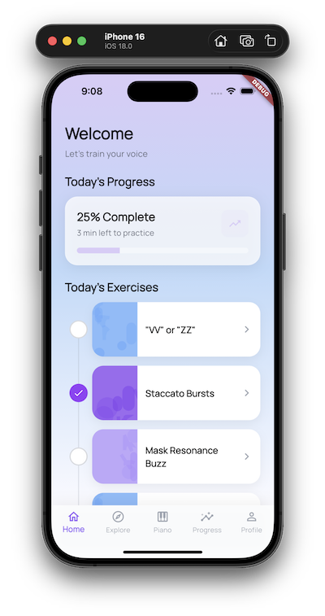
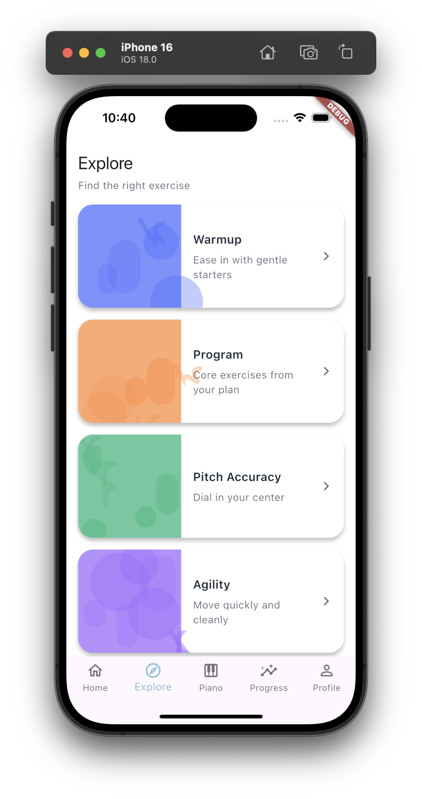
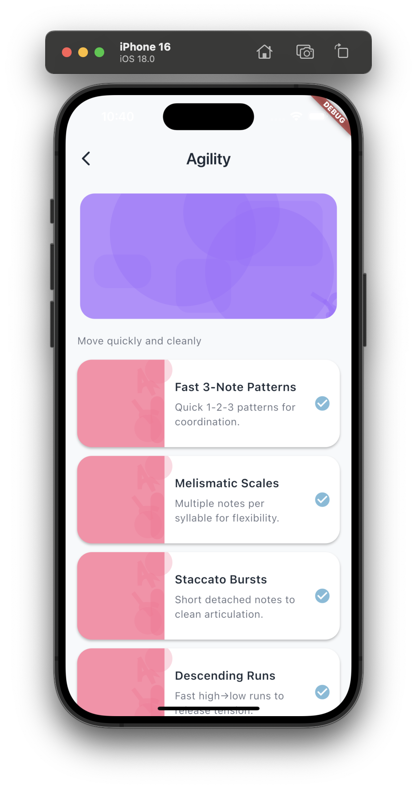
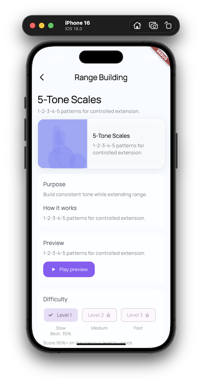
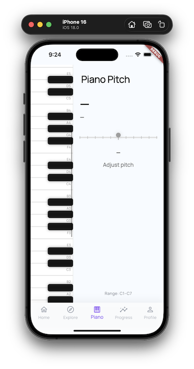

# Crescendo 🎶

*A voice training app for building pitch accuracy, control, and confidence.*

## What is Crescendo?

Crescendo is a mobile app that helps singers improve their voice through interactive exercises and real-time pitch feedback.
It combines structured vocal warmups with a visual “pitch highway” that shows how closely you’re matching target notes as you sing.

The goal is simple: **make vocal practice clear, measurable, and motivating**—without needing a piano, teacher, or studio setup.

## Core Features

* 🎯 Real-time pitch detection and visual feedback
* 🎼 Range-aware vocal exercises
* 📈 Progress tracking and exercise completion
* 🔓 Difficulty levels that unlock as you improve
* 🔁 Review your last take and replay pitch contours

## User Flow

<p align="center">
  <em>A quick tour of the Crescendo workflow.</em>
</p>

<table>
  <tr>
    <td width="50%">
      <b>Home</b><br/>
      Daily recommendations and recent progress.<br/><br/>
      
    </td>
    <td width="50%">
      <b>Explore</b><br/>
      Browse exercises by category and focus area.<br/><br/>
      
    </td>
  </tr>
  <tr>
    <td width="50%">
      <b>Exercise List</b><br/>
      Drill into a category to pick an exercise.<br/><br/>
      
    </td>
    <td width="50%">
      <b>Exercise Preview</b><br/>
      See the goal and instructions before starting.<br/><br/>
      
    </td>
  </tr>
  <tr>
    <td width="50%">
      <b>Pitch Highway</b><br/>
      Real-time pitch feedback while you sing.<br/><br/>
      
    </td>
    <td width="50%">
      <b>Progress</b><br/>
      Track completions and improvements over time.<br/><br/>
      
    </td>
  </tr>
</table>

<p align="center">
  <b>Piano</b> — Explore pitch and reference notes interactively.<br/><br/>
  
</p>


## Tech Stack

* **Flutter** (iOS & Android)
* Real-time audio input and pitch tracking
* Local persistence (SQLite)

## How to Run Locally

### Prerequisites

* Flutter SDK (latest stable)
* Xcode (for iOS) or Android Studio
* A physical device recommended for audio input testing

### Setup

```bash
git clone https://github.com/your-username/crescendo.git
cd crescendo_mobile
flutter pub get
```

### Run

```bash
flutter run
```
